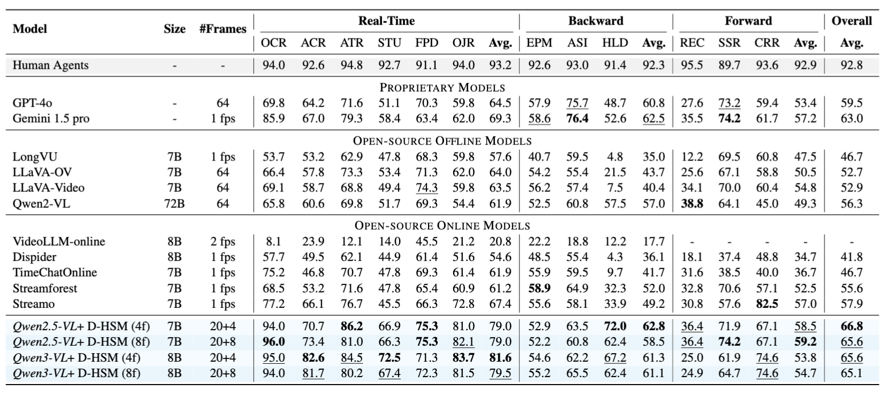
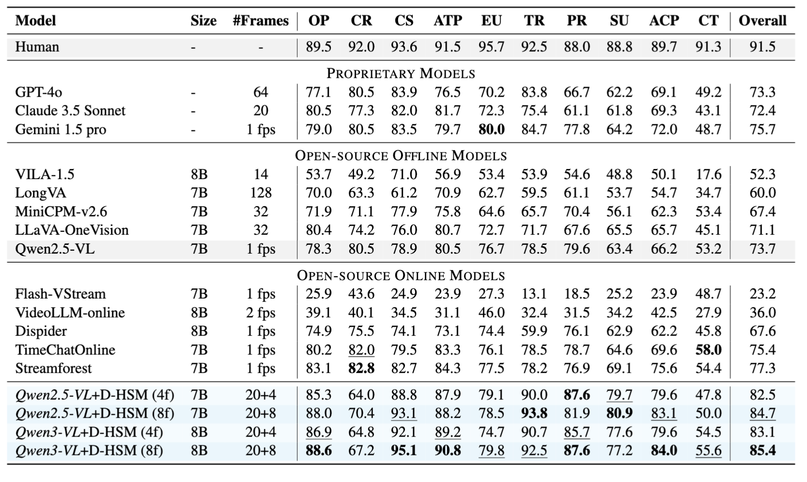

<div align="center">

<h1><b>D-HSM</b> Dynamic Hub-and-Spoke Memory for Streaming Video Understanding</h1>


<p>🔮 <b>Findings of EMNLP 2026</b></p>

<p>
<a href="https://arxiv.org/abs/2608.30294"></a>
<a href="https://arxiv.org/abs/2608.30294"></a>
<a href="https://oshikaka.github.io/DHSM/"></a>
<a href="LICENSE"></a>
<a href="requirements.txt"></a>
</p>

</div>

<p align="center"></p>

D-HSM lets a frozen VLM watch a stream without drowning in it: distant history
is folded into an entity-centred hub-and-spoke memory, while the
few most recent frames stay as visual tokens. Each question then pulls only the
slice of that memory it actually needs. No training, no extra parameters.

## ✨ Highlights

- **Training-free.** A frozen VLM, no finetuning, no extra parameters. Drop it on
  Qwen2.5-VL or Qwen3-VL and it works.
- **History as text, not tokens.** Distant chunks are compressed into typed
  observations (action / spatial / event / OCR) hung off entity hubs, so the
  visual context window stays free for the few frames that actually just arrived.
- **The question decides how much history to read.** A keyword gate first asks
  whether history is needed at all; when it is, similarity retrieval picks a
  question-adaptive subset with a dynamic cutoff, then hub-and-spoke expansion
  pulls in the linked evidence.
- **State of the art on both streaming benchmarks**, at 20+4 frames rather than
  the 1 fps most online baselines consume.

| | OVO-Bench | StreamingBench |
| --- | --- | --- |
| **D-HSM (ours)** | **66.8** | **85.4** |
| best open-source online baseline | 57.9 (Streamo) | 77.3 (Streamforest) |
| Gemini 1.5 Pro | 63.0 | 75.7 |
| GPT-4o | 59.5 | 73.3 |
| Human | 92.8 | 91.5 |

On StreamingBench the same frozen Qwen2.5-VL backbone goes from 73.7 to 84.7
once D-HSM is wrapped around it — the gain is the memory, not the model.

## 📊 Results

Full per-task numbers. D-HSM rows are shaded; **bold** is best, underlined is
second best.

**OVO-Bench**

<p align="center"></p>

**StreamingBench**

<p align="center"></p>

## ⚙️ Quick Start

### 1. Environment
You can also follow the detailed steps in `requirements.txt`.
```bash
# 1. Create vlm conda environment. Install torch separately matching your CUDA *before* run requirements.txt, e.g.:
conda create -n vlm python=3.10.20 && conda activate vlm
pip install torch==2.5.1 torchvision==0.20.1 --index-url https://download.pytorch.org/whl/cu124

# 2. Install the rest of the deps
pip install -r requirements.txt

# 3. flash-attn builds against the torch/CUDA installed in step 1
pip install flash-attn==2.8.3 --no-build-isolation
# or pass --attn-implementation sdpa to skip flash-attn entirely
```

### 2. Benchmarks

The two download scripts fetch annotations and videos. They are large
(OVO-Bench alone is ~144 GB), so give them a disk with room to spare.

Both scripts need `ROOT` — the directory that `data/` will be created under.
Set it on the command line, or edit the `ROOT=` line at the top of each script.
They refuse to run until it is filled in.

```bash
ROOT=/path/to/your/workspace bash scripts/download_ovo.sh            # OVO-Bench
ROOT=/path/to/your/workspace bash scripts/download_streamingbench.sh # StreamingBench
```

Run them with the `vlm` env active so `pip` and `hf` resolve to it. If you would
rather not activate it, point `PY_BIN` at the env instead:

```bash
ROOT=/path/to/your/workspace PY_BIN=~/miniconda3/envs/vlm/bin \
  bash scripts/download_ovo.sh
```

You end up with:

```
$ROOT/data/ovo_bench/ovo_bench_new.json        # --anno_path
$ROOT/data/ovo_bench/chunked_videos/           # --chunked_dir
$ROOT/data/streamingbench/questions_real.json
$ROOT/data/streamingbench/videos/
```

### 3. Models

Two weights: the frozen VLM backbone and the retrieval embedder. The evaluators
also accept plain HF repo ids and will pull them on first use. This script just
puts them somewhere you control.

```bash
ROOT=/path/to/your/workspace bash scripts/download_models.sh
```

```
$ROOT/models/Qwen2.5-VL-7B-Instruct/   # --model_path   (~16 GB)
$ROOT/models/bge-small-en-v1.5/        # --embed_model  (~130 MB)
```

Reproducing a different backbone row? Override the repo:
`VLM_REPO=Qwen/Qwen3-VL-8B-Instruct bash scripts/download_models.sh`.

## 🚀 Run

With the `vlm` env active, the driver script covers the common cases:

```bash
DATA_ROOT=$ROOT/data scripts/run_eval.sh              # both benchmarks
BENCH=ovo DATA_ROOT=$ROOT/data scripts/run_eval.sh    # ovo | sb | both
```

It defaults to the HF repo ids. To use the weights you just downloaded:

```bash
MODEL_PATH=$ROOT/models/Qwen2.5-VL-7B-Instruct \
EMBED_MODEL=$ROOT/models/bge-small-en-v1.5 \
DATA_ROOT=$ROOT/data scripts/run_eval.sh
```

Or call an evaluator directly, you can see more examples at the bottom of `experiments/evaluate_ovo.py` and `experiments/evaluate_streamingbench.py`:

```bash
accelerate launch --num_processes 2 experiments/evaluate_ovo.py \
  --model_path Qwen/Qwen2.5-VL-7B-Instruct \
  --anno_path   /path/to/ovo_bench_new.json \
  --chunked_dir /path/to/chunked_videos \
  --result_dir  results/ovo \
  --recent_frames_only 4 --max_extraction_chunks 20 --use_logits
```

## ⚙️ Defaults

The code ships with the paper's configuration, so you should not need any of
these flags to reproduce the numbers — they are here for when you want to
poke at the method.

| | default | flag |
| --- | --- | --- |
| retrieval gate | `keyword` — question text only | `--routing` |
| memory | `incremental` — Algorithm 2, per-chunk provenance | `--memory_mode` |
| retrieval budget | `dynamic` — salient-gap cutoff capped at K=12 | `--top_k` |
| history budget | 20 chunks | `--max_extraction_chunks` |
| recent window | 4 frames | `--recent_frames_only` |
| embeddings | bge-small-en-v1.5 | `--embed_model` |

Passing an integer to `--top_k` gives the *static* top-K baseline (Table 6
"Fixed Top-k", Fig. 1 point D), not D-HSM.


## 📁 Files

```
dhsm/                            the method; benchmark-agnostic
  retrieval_gate.py              keyword gate (§3.3); question text only, no GPU deps
  hub_and_spoke_incremental.py   Algorithm 2 memory with per-chunk provenance (default)
  hub_and_spoke.py               base memory: scoring, dynamic cutoff, expansion, rendering
  video_qa.py                    Qwen2.5-VL decoding, prompting, logit scoring
  video_qa_qwen3.py              Qwen3-VL cached-vision wrapper
  shard_io.py                    resumable per-rank JSONL checkpointing
experiments/
  ovo_bench.py                   OVO task spec: prompts, answer parsing, scoring
  evaluate_ovo.py                OVO-Bench: backward, real-time, forward (REC/SSR/CRR)
  evaluate_ovo_ablations.py      alternative REC counting / CRR readouts
  evaluate_streamingbench.py     StreamingBench
  verify_retrieval_gate.py       offline routing audit
  compare_gate_ab.py             per-task delta between two routing modes
scripts/
  run_eval.sh                    OVO / StreamingBench driver
  download_ovo.sh                fetch OVO-Bench annotations + chunked videos
  download_streamingbench.sh     fetch StreamingBench questions + videos
  download_models.sh             fetch the VLM backbone + embedder weights
```


## 🙏 Acknowledgements

This work builds on **Qwen2.5-VL / Qwen3-VL** as the frozen backbone,
**SimpleStream** for the streaming evaluation protocol, and the
**OVO-Bench** and **StreamingBench** benchmarks and their released data.
We thank their authors for making the models, code, and data public.

## 📝 Citation

```bibtex
@article{jiang2026dynamic,
  title={Dynamic Hub-and-Spoke Memory for Streaming Video Understanding},
  author={Jiang, Xinru and Zhao, Lin and Xiao, Xi and Zhang, Yunbei and Wang, Janet and Ma, Chenrui and Li, Haolin and Wang, Yanzhi and Gong, Yifan and Camps, Octavia},
  journal={arXiv preprint arXiv:2608.30294},
  year={2026}
}
```
