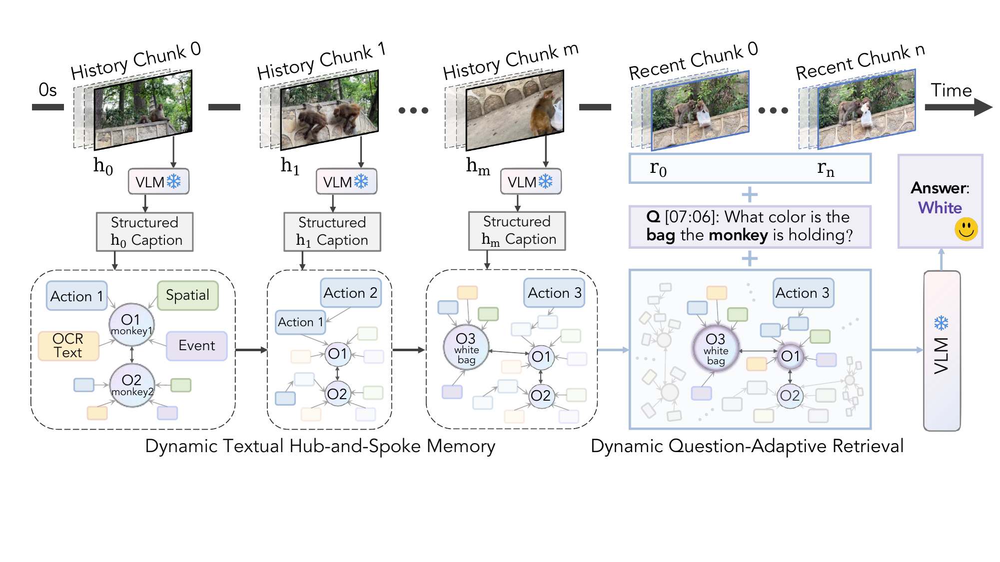

<div align="center">

<h1><b>D-HSM</b> Dynamic Hub-and-Spoke Memory for Streaming Video Understanding</h1>


<p>🔮 <b>Findings of EMNLP 2026</b></p>

<p>
<a href="https://arxiv.org/abs/2608.30294"></a>
<a href="https://arxiv.org/abs/2608.30294"></a>
<a href="https://oshikaka.github.io/DHSM/"></a>
<a href="LICENSE"></a>
<a href="requirements.txt"></a>
</p>

</div>

<p align="center"></p>

D-HSM lets a frozen VLM watch a stream without drowning in it: distant history
is folded into an entity-centred hub-and-spoke memory, while the
few most recent frames stay as visual tokens. Each question then pulls only the
slice of that memory it actually needs. No training, no extra parameters.

## ✨ Highlights

- **Training-free.** A frozen VLM, no finetuning, no extra parameters. Drop it on
  Qwen2.5-VL or Qwen3-VL and it works.
- **History as text, not tokens.** Distant chunks are compressed into typed
  observations (action / spatial / event / OCR) hung off entity hubs, so the
  visual context window stays free for the few frames that actually just arrived.
- **The question decides how much history to read.** A keyword gate first asks
  whether history is needed at all; when it is, similarity retrieval picks a
  question-adaptive subset with a dynamic cutoff, then hub-and-spoke expansion
  pulls in the linked evidence.
- **State of the art on both streaming benchmarks**, at 20+4 frames rather than
  the 1 fps most online baselines consume.


## ⚙️ Quick Start

### 1. Environment
You can also follow the detailed steps in `requirements.txt`.
```bash
# 1. Create the vlm conda env. Install torch matching your CUDA *before* requirements.txt, e.g.:
conda create -n vlm python=3.10.20 && conda activate vlm
pip install torch==2.9.1 torchvision==0.24.1 torchcodec==0.9.0 --index-url https://download.pytorch.org/whl/cu128

# 2. Install the rest of the deps
pip install -r requirements.txt

# 3. flash-attn (the default attention backend), built against the torch/CUDA installed in step 1.
#    Or skip it and pass --attn_implementation sdpa (ATTN_IMPLEMENTATION=sdpa for run_eval.sh).
pip install flash-attn==2.8.3 --no-build-isolation
```

### 2. Benchmarks

The two download scripts fetch annotations and videos. They are large
(OVO-Bench alone is ~144 GB), so give them a disk with room to spare.

Every command below runs from the repo root and uses `ROOT` — the directory
that `data/` and `models/` will be created under. Export it once in your shell
so the download, model and run steps all see the same value (the download
scripts refuse to run until it is set):

```bash
export ROOT=/path/to/your/workspace
bash scripts/download_ovo.sh            # OVO-Bench
bash scripts/download_streamingbench.sh # StreamingBench
```

Run them with the `vlm` env active so `pip` and `hf` resolve to it. If you would
rather not activate it, point `PY_BIN` at the env instead:

```bash
PY_BIN=~/miniconda3/envs/vlm/bin bash scripts/download_ovo.sh
```

You end up with:

```
$ROOT/data/ovo_bench/ovo_bench_new.json        # --anno_path
$ROOT/data/ovo_bench/chunked_videos/           # --chunked_dir
$ROOT/data/streamingbench/questions_real.json  # --anno_path
$ROOT/data/streamingbench/videos/              # --video_dir
```

### 3. Models

Two weights: the frozen VLM backbone and the retrieval embedder. The evaluators
also accept plain HF repo ids and will pull them on first use. This script just
puts them somewhere you control.

```bash
bash scripts/download_models.sh   # uses the exported ROOT
```

```
$ROOT/models/Qwen2.5-VL-7B-Instruct/   # --model_path   (~16 GB)
$ROOT/models/bge-small-en-v1.5/        # --embed_model  (~130 MB)
```

Reproducing a different backbone row? Override the repo:
`VLM_REPO=Qwen/Qwen3-VL-8B-Instruct bash scripts/download_models.sh`.

## 🚀 Run

With the `vlm` env active and from the repo root (the script calls
`experiments/*.py` by relative path), the driver script covers the common cases.
`$ROOT` is the one you exported above; if this is a new shell, export it again first.

```bash
DATA_ROOT=$ROOT/data scripts/run_eval.sh                                # both benchmarks
BENCH=ovo DATA_ROOT=$ROOT/data scripts/run_eval.sh                      # ovo | sb | both
BENCH=sb RECENT_FRAMES=8 DATA_ROOT=$ROOT/data scripts/run_eval.sh       # change the recent window
```

It defaults to the HF repo ids `Qwen/Qwen2.5-VL-7B-Instruct` and
`BAAI/bge-small-en-v1.5`. To use the weights you just downloaded:

```bash
MODEL_PATH=$ROOT/models/Qwen2.5-VL-7B-Instruct \
EMBED_MODEL=$ROOT/models/bge-small-en-v1.5 \
DATA_ROOT=$ROOT/data scripts/run_eval.sh
```

Other knobs: `NPROC` sets the GPU count (default 2), `OUT` the result directory,
and `ATTN_IMPLEMENTATION` the attention backend (default `flash_attention_2`).

Or call an evaluator directly; more examples sit at the bottom of
`experiments/evaluate_ovo.py` and `experiments/evaluate_streamingbench.py`:

```bash
accelerate launch --num_processes 2 experiments/evaluate_ovo.py \
  --model_path Qwen/Qwen2.5-VL-7B-Instruct \
  --anno_path   /path/to/ovo_bench_new.json \
  --chunked_dir /path/to/chunked_videos \
  --result_dir  results/ovo \
  --recent_frames_only 4 --max_extraction_chunks 20 --use_logits
```

## ⚙️ Defaults

The code ships with the paper's configuration, so you should not need any of
these flags to reproduce the numbers — they are here for when you want to
poke at the method.

| | default | flag |
| --- | --- | --- |
| retrieval gate | `keyword` — question/option text only, never task labels or answers | `--routing` |
| memory | `entity_resolved` — chunk-local entity IDs linked across chunks by similarity | `--memory_mode` |
| retrieval budget | `dynamic` — salient-gap cutoff, capped per backbone on OVO (8 for Qwen2.5-VL, 12 otherwise) and at 12 on StreamingBench | `--top_k`, `--dynamic_top_k_max` |
| history budget | 20 chunks | `--max_extraction_chunks` |
| recent window | 4 frames | `--recent_frames_only` |
| embeddings | bge-small-en-v1.5 | `--embed_model` |
| attention | `flash_attention_2` (`sdpa` to skip flash-attn) | `--attn_implementation` |
| OVO MCQ prompt | `uniform_abstention` — one instruction for every MCQ task | `--mcq_prompt_policy` |

Passing an integer to `--top_k` gives the *static* top-K baseline (Table 6
"Fixed Top-k", Fig. 1 point D), not D-HSM. `--memory_mode` also accepts
`hub_spoke`, `flat_caption` and `incremental` (Algorithm 2 with per-chunk
provenance) for ablations, and `--history_mode recent_only` on OVO drops memory
entirely for the recent-frames-only baseline.

Results are checkpointed per rank and resumed on restart; a run directory
refuses to resume under a different protocol, so point `OUT` / `--result_dir`
somewhere new when you change flags.


## 🙏 Acknowledgements

This work builds on **Qwen2.5-VL / Qwen3-VL** as the frozen backbone,
**SimpleStream** for the streaming evaluation protocol, and the
**OVO-Bench** and **StreamingBench** benchmarks and their released data.
We thank their authors for making the models, code, and data public.

## 📝 Citation

```bibtex
@article{jiang2026dynamic,
  title={Dynamic Hub-and-Spoke Memory for Streaming Video Understanding},
  author={Jiang, Xinru and Zhao, Lin and Xiao, Xi and Zhang, Yunbei and Wang, Janet and Ma, Chenrui and Li, Haolin and Wang, Yanzhi and Gong, Yifan and Camps, Octavia},
  journal={arXiv preprint arXiv:2608.30294},
  year={2026}
}
```
